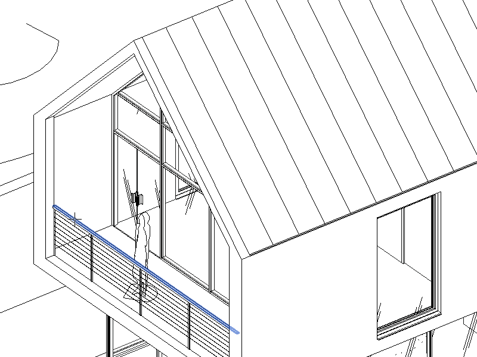
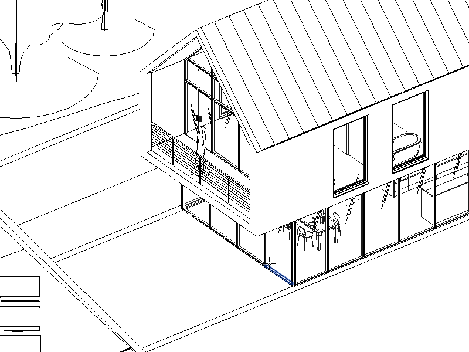

# Clipper for Autodesk Revit

Clipper is a plugin for Autodesk Revit that enables precise, one-click creation of section in 3D views by automatically adjusting the section box.

## Features

### Clip by Plane
Creates a section cut through a selected planar surface.

### Clip by Normal
Creates a section cut perpendicular to a selected point on a surface.

## Installation

Download and run the installer for your Revit version:

- [Revit 2023 Installer](https://github.com/GeorgiiSokolov/Clipper/releases/download/v0.03-alpha/clipper-0.03a-2023.exe)
- [Revit 2024 Installer](https://github.com/GeorgiiSokolov/Clipper/releases/download/v0.03-alpha/clipper-0.03a-2024.exe)
- [Revit 2025 Installer](https://github.com/GeorgiiSokolov/Clipper/releases/download/v0.03-alpha/clipper-0.03a-2025.exe)

## Credits

- Georgii Sokolov

## License

This project is licensed under the [MIT License](http://opensource.org/licenses/MIT).
